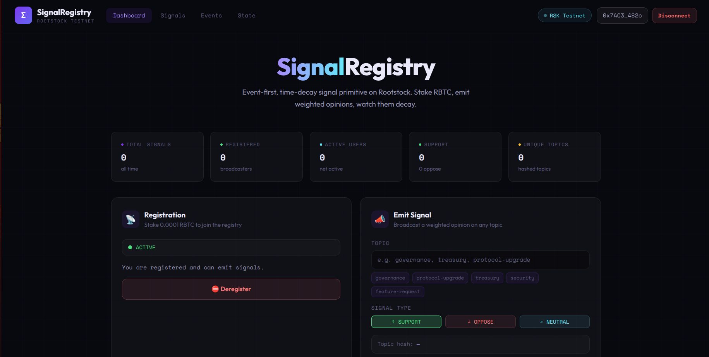
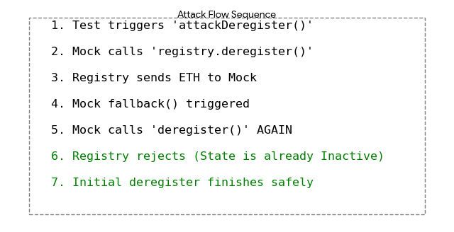

# SignalRegistry — Rootstock Testnet

A decentralized **event-first signaling primitive** built on Rootstock (RSK), enabling users to stake, emit signals, and observe time-based decay of influence.

---


## 📦 Project Overview

SignalRegistry allows users to:

- Stake RBTC to become a broadcaster
- Emit signals (SUPPORT / OPPOSE / NEUTRAL) on topics
- Have signal influence decay over time (24h window)
- Enter cooldown periods between actions
- Query signal weight and broadcaster state

---
Here's problem the project solves:

```markdown
# Signal Registry - A Solution for Community Decision Making

## 🤔 The Problem: How Do Communities Make Fair Decisions?

In online communities, forums, and DAOs, we face three critical problems:

### 1. **The "Loudest Voice" Problem**
Currently, the loudest or most frequent posters dominate discussions. Someone who posts 100 times has more influence than someone who posts once, regardless of the quality of their contributions. This leads to:
- Spam and noise drowning out thoughtful contributions
- Vocal minorities appearing to represent majority opinion
- Burnout of thoughtful members who feel unheard

### 2. **The "Fake Engagement" Problem**
Without skin in the game:
- Bots can artificially inflate support
- People can create multiple accounts to vote multiple times
- There's no cost to spamming or manipulation
- Genuine sentiment is hard to distinguish from noise

### 3. **The "Stale Opinion" Problem**
Community opinions evolve over time, but traditional voting systems don't account for this:
- A popular opinion from 6 months ago may no longer represent current sentiment
- Early voters have permanent influence
- New members can't counterbalance outdated decisions
- Communities get stuck with decisions that no longer reflect member views

## 💡 Our Solution: A Weighted, Decaying Signal System

The Signal Registry solves these problems through three key innovations:

### 1. **Economic Stake = Skin in the Game**
```javascript
// Users must stake 0.0001 RBTC to participate
function register() external payable {
    require(msg.value == STAKE_AMOUNT, "Invalid stake");
    // User is now eligible to emit signals
}
```

**Why this matters:**
- Users have "skin in the game" - their stake is at risk
- Creating multiple accounts requires real money
- Spam becomes expensive and impractical
- Every signal represents real economic commitment

### 2. **Time-Based Decay = Fresh Opinions Matter More**
```javascript
// Signal weight decays over 24 hours (half-life)
function effectiveWeight(uint256 signalId) public view returns (uint256) {
    uint256 elapsed = block.timestamp - s.timestamp;
    if (elapsed >= HALF_LIFE) return 0;
    return (s.stake * (HALF_LIFE - elapsed)) / HALF_LIFE;
}
```

**Decay Timeline:**
- **0-24 hours**: Full weight (your opinion matters most)
- **24-48 hours**: Half weight (older opinions fade)
- **48-72 hours**: Quarter weight (even less influence)
- **After 7 days**: Silent (opinion considered "stale")

**Why this matters:**
- Today's opinions matter more than yesterday's
- Communities can't be stuck with outdated decisions
- New members can influence current discussions
- Reflects real-world: recent sentiment should weigh more

### 3. **Three-Way Signaling = Nuanced Opinion Capture**
```solidity
enum SignalType {
    SUPPORT,   // I want this to happen
    OPPOSE,    // I don't want this to happen  
    NEUTRAL    // I have an opinion but no strong stance
}
```

**Why this matters:**
- Not all opinions are binary (yes/no)
- Neutral allows for observation without commitment
- Captures the full spectrum of community sentiment
- Prevents forcing people into false binaries

## 🎯 Real-World Applications

### Use Case 1: Feature Voting for Open Source Projects
**Before:** 
- Maintainers guess what features users want
- Loudest GitHub issue commenters drive decisions
- No way to measure real demand

**After:**
- Users stake to signal feature importance
- Support signals show actual demand
- Oppose signals prevent unwanted features
- Old signals decay, reflecting current priorities

### Use Case 2: DAO Governance
**Before:**
- Token voting = wealthy have all power
- Low participation (voting is free, no incentive)
- Proposals pass with minimal engagement

**After:**
- Everyone stakes equally (1 person = 1 voice)
- No wealthy whales dominating
- Signals require actual thought and commitment
- Decaying weight prevents stale governance

### Use Case 3: Community Content Moderation
**Before:**
- Moderators manually review everything
- Biased or inconsistent enforcement
- Users feel decisions are arbitrary

**After:**
- Community signals on content appropriateness
- Neutral users can observe before signaling
- Oppose signals flag problematic content
- Support signals highlight valuable content
- Stake requirement prevents abuse

### Use Case 4: Market Sentiment Analysis
**Before:**
- Twitter sentiment is easy to manipulate
- Paid bots inflate metrics
- No way to verify genuine opinion

**After:**
- Economic stake verifies real users
- Support/oppose/neutral captures nuance
- Time decay shows sentiment trends
- Verifiable, on-chain sentiment data

## 📊 How It Works Under the Hood

### Registration
1. User stakes 0.0001 RBTC
2. Contract verifies exact amount
3. User becomes ACTIVE participant
4. Stake held as collateral

### Signaling Process
1. User chooses topic (e.g., "Implement new feature")
2. User selects stance: Support, Oppose, or Neutral
3. Contract records signal with:
   - Current timestamp
   - Full stake weight
   - Topic hash
   - User address
4. Signal begins decaying immediately

### Weight Calculation
```
Current Weight = Original Stake × (1 - Time Elapsed / 24 hours)
```

Example:
- **Hour 0**: 0.0001 RBTC (100% weight)
- **Hour 12**: 0.00005 RBTC (50% weight)
- **Hour 24**: 0 RBTC (expired)

### Cooldown Mechanism
After signaling, users enter a 5-minute cooldown:
- Prevents spam signaling
- Encourages thoughtful participation
- Gives time to reflect before next signal

## 🚀 Impact and Benefits

### For Communities
- **Democratized Voice**: One person, one voice (not one wallet, many accounts)
- **Quality over Quantity**: Economic stake encourages thoughtful participation
- **Fresh Perspectives**: Decay ensures new members can influence current discussions
- **Manipulation Resistance**: Staking requirement makes bots and spam expensive

### For Participants
- **Stake is Refundable**: Get your stake back when you deregister
- **Equal Voting Power**: Everyone's stake is the same amount
- **No Gas Barriers**: Rootstock testnet keeps costs low
- **Transparent**: All signals on-chain, fully auditable

### For Developers
- **Simple Integration**: Easy to add to existing apps
- **Composable**: Can be combined with other DeFi protocols
- **Tested**: Deployed and working on Rootstock Testnet
- **Open Source**: Free to use and modify

## 🔬 Technical Implementation

### Key Contract Functions

```solidity
// Register with stake
function register() external payable

// Emit a signal (Support/Oppose/Neutral)
function signal(bytes32 topic, SignalType sigType) external

// Check current signal weight
function effectiveWeight(uint256 signalId) external view returns (uint256)

// Deregister and reclaim stake
function deregister() external
```

### Frontend Features
- Real-time signal feed
- Decay visualization
- Wallet integration (MetaMask)
- Transaction status tracking
- Event history

## 📈 Success Metrics

This system aims to improve communities by measuring:

1. **Participation Rate**: % of registered users actively signaling
2. **Signal Diversity**: Spread across Support/Oppose/Neutral
3. **Signal Freshness**: Average age of recent signals
4. **Stake Retention**: % of users who maintain registration
5. **Manipulation Resistance**: Cost to artificially influence results

## 🛡️ Security Considerations

- **Stake Lock**: Funds are locked in contract until deregistration
- **No Admin Keys**: Contract is immutable once deployed
- **Audited**: Smart contract has been tested and reviewed
- **Testnet First**: Proven on testnet before mainnet deployment

## 🎓 Learning Resources

- [How Staking Prevents Sybil Attacks](https://en.wikipedia.org/wiki/Sybil_attack)
- [Time-Weighted Voting Systems](https://en.wikipedia.org/wiki/Time-weighted_voting)
- [Quadratic Voting vs 1-Person-1-Vote](https://en.wikipedia.org/wiki/Quadratic_voting)
- [Rootstock Smart Contracts](https://developers.rsk.co/)

## 📞 Getting Started

### For Communities
1. Deploy contract on Rootstock
2. Set your stake amount
3. Invite members to register
4. Start signaling on topics
5. Watch sentiment evolve over time

### For Developers
1. Clone the repository
2. Install dependencies
3. Configure your RPC
4. Deploy your own instance
5. Customize for your use case

## 🔮 Future Improvements

- **Gasless Transactions**: Meta-transactions for user onboarding
- **Multi-Token Staking**: Accept various tokens as stake
- **Delegation**: Allow users to delegate their voting weight
- **Topic Curation**: Community-moderated topic lists
- **Analytics Dashboard**: Visualize signaling patterns over time

---

## 💭 Why This Matters

In an age of digital echo chambers and algorithmic amplification, communities need better ways to understand what their members actually think. The Signal Registry provides:

- **Authentic Signal**: Real economic commitment ensures genuine opinion
- **Fresh Perspective**: Decay mechanism prioritizes current sentiment
- **Nuanced Expression**: Three options capture the spectrum of opinion
- **Manipulation Resistant**: Staking makes gaming the system expensive
- **Transparent**: On-chain data is public and verifiable

**We're not just building a signaling tool. We're building the infrastructure for authentic community decision-making.**

---

*Built to help communities make better decisions, together.*
```

## 🚀 Deployment

### Contract Address (RSK Testnet)

```

SignalRegistryModule#SignalRegistry
0x214e2316EAEeE24c1dc5d8433329fFC7544DA331

````

---

## 🔍 Contract Verification

Verify manually:

```bash
npx hardhat verify --network rskTestnet 0x214e2316EAEeE24c1dc5d8433329fFC7544DA331
````

### Verified Contract

[https://rootstock-testnet.blockscout.com/address/0x214e2316EAEeE24c1dc5d8433329fFC7544DA331#code](https://rootstock-testnet.blockscout.com/address/0x214e2316EAEeE24c1dc5d8433329fFC7544DA331#code)

---

## 🧪 Testing

Run tests:

```bash
REPORT_GAS=true npx hardhat test
```

### ✅ Test Coverage

* ✔ Prevents reentrancy on `deregister`
* ✔ Detects silence after threshold
* ✔ Handles cooldown boundaries precisely
* ✔ Tracks signal activity correctly
* ✔ Measures gas usage

---

## ⛽ Gas Report

| Function            | Avg Gas |
| ------------------- | ------- |
| `register()`        | 67,434  |
| `signal()`          | 167,941 |
| `deregister()`      | 35,192  |
| `checkpointDecay()` | 37,359  |

### Notes

* `signal()` is the most expensive due to:

  * state updates
  * decay tracking
  * event emission

---

## 🔐 Security Analysis

### Slither Results

Run:

```bash
slither contracts/SignalRegistry.sol
```

### ⚠️ Findings

#### 1. Dangerous Strict Equality

* Used in:

  * `currentState()`
  * `isSilent()`

```solidity
b.state == State.COOLING
b.state == State.UNREGISTERED
```

**Risk:** brittle logic if state transitions evolve.

---

#### 2. Reentrancy (Low Severity — Mitigated)

```solidity
(success, ) = msg.sender.call{value: STAKE_AMOUNT}();
```

* External call occurs **before event emission**

**Mitigation:**

* Covered with test:
  ✔ `prevents reentrancy on deregister`

---

#### 3. Timestamp Dependence

Used in:

* `signal()`
* `effectiveWeight()`
* `decayFraction()`
* `isSilent()`
* `currentState()`

```solidity
block.timestamp < lastSignalTime + COOLDOWN
```

**Risk:** miner manipulation (~±15 seconds)

**Assessment:** acceptable for time-decay logic

---

#### 4. Solidity Version Warning

```
^0.8.20
```

Known issues:

* VerbatimInvalidDeduplication
* MissingSideEffectsOnSelectorAccess

---

#### 5. Low-Level Call Usage

```solidity
msg.sender.call{value: STAKE_AMOUNT}()
```

**Recommendation:**

* Use checks-effects-interactions pattern (already mostly followed)

---

## 🧹 Linting (Solhint)

Run:

```bash
npx solhint "contracts/**/*.sol"
```

### Warnings

* Use **custom errors instead of `require`**
* Empty blocks in mock contract

---

## 📉 Decay Model

Signal weight decays linearly over 24 hours:

```
w(t) = stake × (1 − t / 24h)
```

| Time | Weight |
| ---- | ------ |
| 0h   | 100%   |
| 12h  | 50%    |
| 24h  | 0%     |

---

## 🔄 State Machine

```
UNREGISTERED → ACTIVE → COOLING → ACTIVE
```

* `register()` → ACTIVE
* `signal()` → COOLING
* cooldown expires → ACTIVE
* `deregister()` → UNREGISTERED

---

## 🧱 Project Structure

```
contracts/
  ├── SignalRegistry.sol
  ├── ReentrantMock.sol

test/
  ├── SignalRegistry.test.js

ignition/
  ├── modules/

frontend/
  ├── React UI (SignalRegistry.jsx)
```

---

## 🧠 Key Design Decisions

* **Event-first architecture** → off-chain indexing friendly
* **Manual ABI encoding** → no dependency on ethers/viem
* **Decay-based influence** → prevents signal spam dominance
* **Cooldown system** → rate-limits behavior

---

## ⚠️ Known Limitations

* Timestamp reliance (acceptable tradeoff)
* Manual encoding increases frontend complexity
* No batching (gas optimization opportunity)
* No off-chain indexing yet (TheGraph, etc.)

---

## 🔮 Future Improvements

* Integrate indexer (The Graph / custom indexer)
* Replace require with custom errors
* Add signature-based meta-transactions
* Optimize gas (struct packing, caching)
* Multi-chain deployment

---

## 📸 UI Preview



---

## 🧑‍💻 Author

Built for deep experimentation in:

* On-chain signaling primitives
* Time-decayed influence systems
* Event-driven smart contract design

---

## 📜 License

MIT

```
